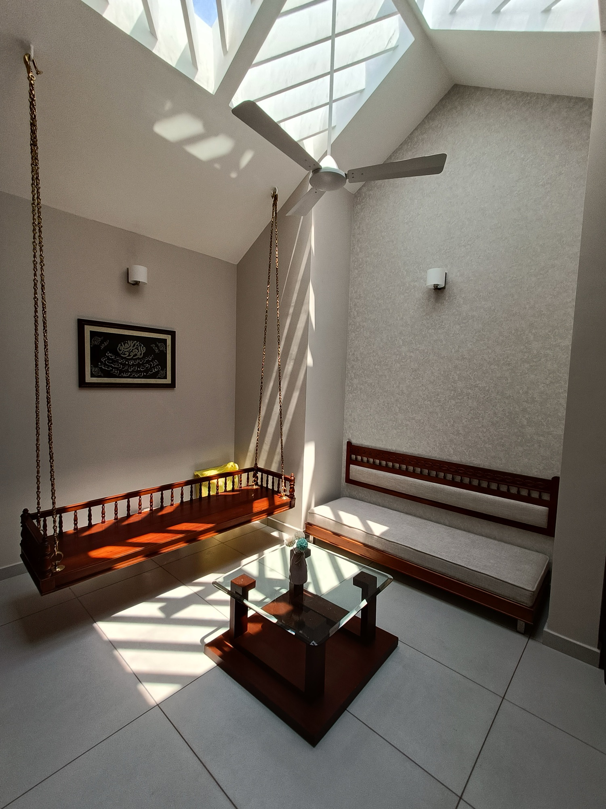
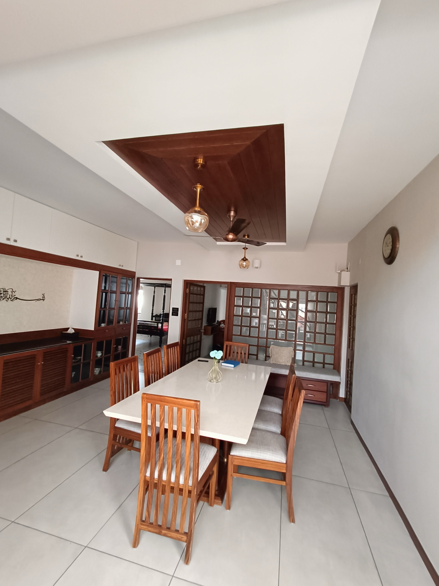
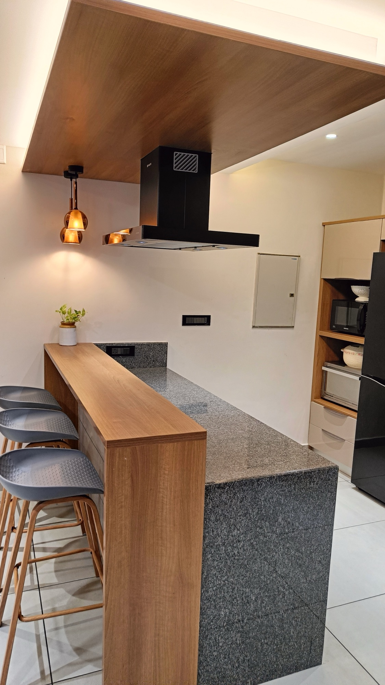
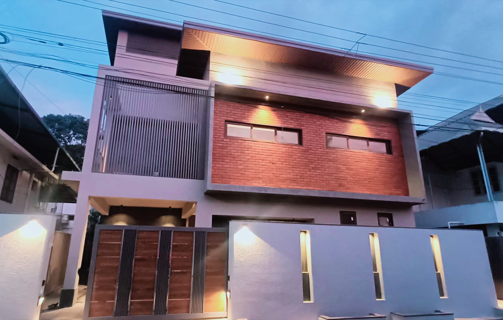
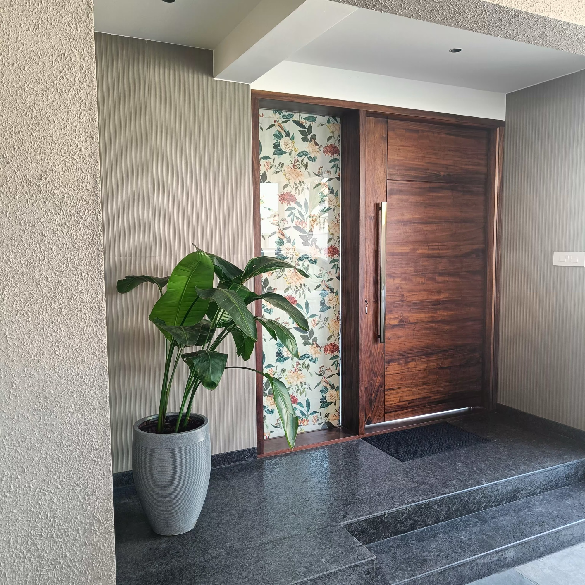
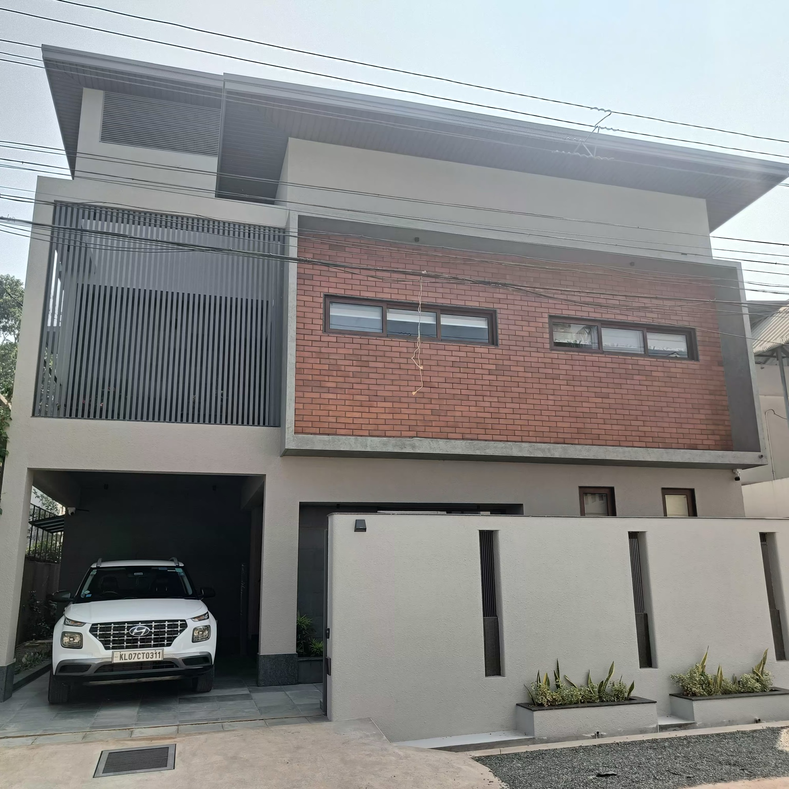
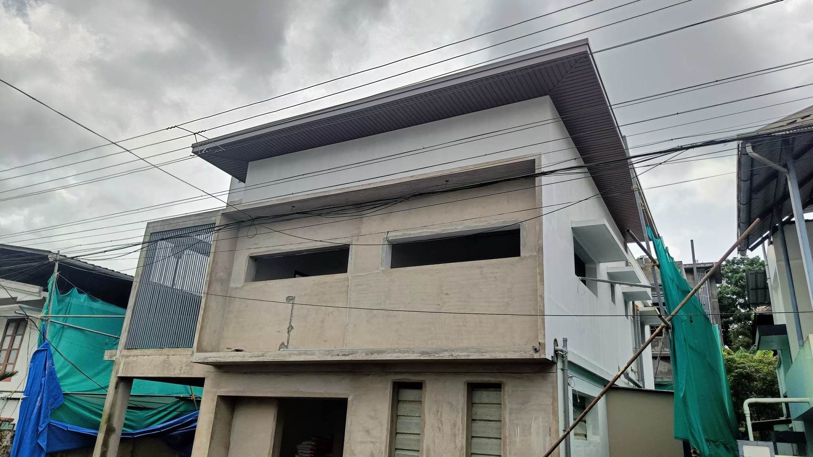

<p align="center">
  
</p>

<h3 align="center"><em>Interiors shaped by twenty years of practice.</em></h3>

<p align="center">
  Interior architecture and design studio in Kerala, India, and the single-page portfolio that shows its work.<br>
  Villas, apartments and renovations, photographed at handover without staging.
</p>

<p align="center">
  
  
  
  
  
  
  
</p>

<p align="center">
  
  <br>
  <sub><b>Skylit Courtyard Villa</b> · The courtyard, mid-morning</sub>
</p>

<p align="center">
  <a href="#the-studio">Studio</a> ·
  <a href="#selected-work">Selected work</a> ·
  <a href="#digital-experience">Digital experience</a> ·
  <a href="#architecture">Architecture</a> ·
  <a href="#local-development">Development</a> ·
  <a href="#photography-workflow">Photography workflow</a> ·
  <a href="#contact">Contact</a>
</p>

---

## The studio

> ### “A room should hold light well, wear well, and ask nothing of the people who live in it.”
>
> <sub>El Conceptz · design philosophy</sub>

El Conceptz is an interior architecture and design practice based in Kerala, India, with more than twenty years of work across villas, apartments and renovations. The studio carries a project from the first plan to the final fitting: spatial planning, joinery drawings, lighting, material selection and the site supervision that holds it all together.

Every brief starts with how a family actually lives. The result should look considered and feel effortless: materials that age gracefully, storage that disappears, lighting that changes with the day.

|              |                                                                                   |
| :----------- | :-------------------------------------------------------------------------------- |
| **Practice** | 20+ years of interior architecture and design                                     |
| **Base**     | Kerala, India (Karunagappally · Kochi)                                            |
| **Scope**    | Villas, apartments, renovations                                                   |
| **Design**   | Residential interiors, space planning                                             |
| **Make**     | Custom furniture and joinery, kitchens and wardrobes, false ceilings and lighting |
| **Build**    | Bathroom renovation, turnkey execution                                            |

> [!NOTE]
> **Zero staging.** Every photograph in this repository and on the live site was taken at handover, in the client's home, with the client's furniture. Nothing was dressed for the camera. Camera positions in before and after pairs are close rather than identical, as is usual for site photography.

## Selected work

Homes photographed as they were handed over, without staging. Six projects live in the repository; two are shown here.

<table align="center">
  <tr>
    <td width="33%" valign="top"><br><sub><b>The courtyard, mid-morning</b> · Courtyard<br>Rosewood swing beneath a pitched skylight; moving light across the double-height volume</sub></td>
    <td width="33%" valign="top"><br><sub><b>Dining room</b> · Dining<br>Teak coffered ceiling with amber glass pendants</sub></td>
    <td width="33%" valign="top"><br><sub><b>Kitchen island and breakfast bar</b> · Kitchen<br>Grey granite island with a raised walnut breakfast bar</sub></td>
  </tr>
  <tr>
    <td colspan="3" align="center"><sub><b>Skylit Courtyard Villa</b> · Villa · 2022 · Warm oak, teak and walnut against white gloss and grey granite</sub></td>
  </tr>
  <tr>
    <td width="33%" valign="top"><br><sub><b>The house at dusk</b> · Facade<br>Exposed-brick upper volume over grey render, vertical louvre screen, slot-lit compound wall</sub></td>
    <td width="33%" valign="top"><br><sub><b>The entrance</b> · Entry<br>Walnut door, floral wallpaper panel, granite steps</sub></td>
    <td width="33%" valign="top"><br><sub><b>Street elevation</b> · Exterior<br>Brick, render and louvre screen as handed over</sub></td>
  </tr>
  <tr>
    <td colspan="3" align="center"><sub><b>Brick and Walnut Residence</b> · Villa · 2026 · Cantilevered teak staircase, copper-effect powder room, side garden with a rockery water feature</sub></td>
  </tr>
</table>

<details>
<summary><b>All six projects in the repository</b></summary>

| Project                          | Type                 | Year | Signature                                          |
| :------------------------------- | :------------------- | :--: | :------------------------------------------------- |
| Skylit Courtyard Villa           | Villa                | 2022 | Rosewood swing beneath a pitched skylight          |
| Teak and Grey Stone Villa        | Villa                | 2022 | Formal living, home theatre, stair hall            |
| Terracotta Jali Villa            | Villa                | 2023 | Jali staircase under exposed terracotta roof tiles |
| Cement and Timber Villa          | Villa                | 2023 | Double-height cement-textured wall, timber passage |
| Walnut and Taupe Gloss Apartment | Apartment renovation | 2024 | L-shaped taupe gloss kitchen, walnut wash alcove   |
| Brick and Walnut Residence       | Villa                | 2026 | Louvre-screened brick facade, walnut island        |

Project folders live in `public/images/projects/<slug>/`; each project is described once in `content/projects.ts`.

</details>

### Before and after

The same viewpoint, before work began and after handover. On the site these pairs drive the comparison slider; here they sit side by side.

<table align="center">
  <tr>
    <td width="50%"><br><sub><b>Before</b> · Street elevation</sub></td>
    <td width="50%"><br><sub><b>After</b> · Street elevation</sub></td>
  </tr>
</table>

## Digital experience

The site is a single, long editorial page. Each section is a "room", and motion is used the way light is used in the interiors: to give the eye somewhere to settle, never to perform.

<table>
<tr>
<td width="33%" valign="top">

### Before &amp; After slider

Pointer, touch and keyboard comparison of the same viewpoint before work began and after handover. Pointer capture keeps the drag stable on phones; arrow keys step the divider, <kbd>Home</kbd> and <kbd>End</kbd> jump to either side, and the handle exposes `aria-valuenow` so screen readers announce the split. The divider nudges once on first view, then stops the moment the visitor touches it.

</td>
<td width="33%" valign="top">

### GSAP &amp; ScrollTrigger choreography

A single entry point registers ScrollTrigger, ScrollToPlugin and CustomEase once and names the brand easing curves so every tween shares them. Headings reveal word by word, photographs travel on a scrubbed parallax track, the header compacts on scroll and anchor links glide to their section with the compact header height already subtracted. `gsap.matchMedia()` scales motion down on phones and honours `prefers-reduced-motion`.

</td>
<td width="33%" valign="top">

### Zero-staging lightbox

One lightbox provider is shared by every photo grid on the page. Select a photograph and it opens full screen at its intrinsic size with a blur placeholder already painted. <kbd>Esc</kbd> closes, arrows step, swipe steps on touch, and the counter is an `aria-live` region so the position is announced without the visitor hunting for it.

</td>
</tr>
</table>

Three motion libraries, each with a job:

| Library                       | Role on the page                                                                                                                                                                |
| :---------------------------- | :------------------------------------------------------------------------------------------------------------------------------------------------------------------------------ |
| **GSAP 3.15 + ScrollTrigger** | All scroll-linked choreography: parallax frames, scrubbed reveals, section pinning, smooth anchor scrolling, heading marks.                                                     |
| **Anime.js 4**                | A few precise instruments: the drafting-line animation in the opening scene and the brand lockup timeline. Shares the GSAP easing curves.                                       |
| **Framer Motion**             | Declarative enter and exit transitions inside React trees: the lightbox slide, word reveals, the mobile menu. Wrapped in a `MotionConfig` that honours reduced motion globally. |

## Architecture

The site is content-driven. Everything a visitor reads or sees is declared once in `content/`, typed by `types/index.ts`, and rendered by components that carry no copy and no image paths of their own. Rename a project, swap a photograph or change the contact number and every section follows.

| Layer               | Path               | Responsibility                                                                                                         | Rule                                                                                                                                   |
| :------------------ | :----------------- | :--------------------------------------------------------------------------------------------------------------------- | :------------------------------------------------------------------------------------------------------------------------------------- |
| **Content**         | `content/*.ts`     | Studio facts, editorial copy, projects, before/after pairs, gallery order, services, contact channels, theme constants | The only place text and media paths live. Every file is typed by `types/index.ts`.                                                     |
| **Presentation**    | `components/*`     | One component per room of the page, plus brand, navigation, gallery, slider and UI primitives                          | Never hardcodes a string or an image path. Reads from `content/` and renders.                                                          |
| **Runtime helpers** | `lib/*`, `hooks/*` | GSAP and Anime entry points, image resolution, motion constants, section tracking, reduced-motion guards               | `lib/gsap.ts` is the single GSAP import; plugins register exactly once. `lib/image-manifest.ts` is generated and never edited by hand. |
| **Pipeline**        | `scripts/*.mjs`    | Photo export from the studio library and image manifest generation                                                     | Produces `public/images/**` and `lib/image-manifest.ts`. Run after any photo change.                                                   |

> [!IMPORTANT]
> **The content contract.** A component that needs a heading imports it from `content/copy.ts`. A component that needs a photograph receives a `PhotoRef` declared in `content/projects.ts` and resolves its size and blur placeholder through `lib/images.ts`. No exceptions. This is what lets the studio update the site without touching a component.

<details>
<summary><b>Directory tree</b></summary>

```text
app/                                # Next.js 16 App Router
├── layout.tsx                      # Root layout, fonts (Cormorant Garamond, Manrope), providers
├── page.tsx                        # The single page: sections in reading order
├── globals.css                     # Design tokens, Tailwind v4 @theme, typography primitives
├── opengraph-image.tsx             # Generated social image
├── robots.ts · sitemap.ts · icon.svg

components/
├── sections/                       # Opening, Studio, SelectedWork, ProjectStory, Transformation,
│                                   # Gallery, Services, Philosophy, Contact, Footer
├── before-after/                   # BeforeAfterSlider (pointer, touch, keyboard)
├── gallery/                        # Lightbox + LightboxProvider shared by every grid
├── navigation/                     # Header, MobileMenu, AnchorScroll, ScrollProgress
├── motion/ · ui/ · work/           # HeadingMarks, ParallaxFrame, Reveal, WordReveal, Photo, WorkItem
├── brand/ · contact/ · seo/        # Logo, AnimatedMark, ContactActionRow, JsonLd
└── providers/                      # MotionProvider (reduced-motion aware)

content/                            # Everything the visitor reads or sees
├── site.ts · copy.ts · navigation.ts
├── projects.ts · beforeAfter.ts · gallery.ts
├── services.ts · studio.ts · contact.ts
└── theme.ts                        # Palette, radius rule, easing and duration constants

hooks/                              # useActiveSection, useLockBodyScroll, useReducedMotionSafe
lib/                                # gsap.ts, anime.ts, motion.ts, images.ts, image-manifest.ts (generated), utils.ts
scripts/                            # import-photos.mjs, generate-image-manifest.mjs, photo-selection.json
types/                              # index.ts: Project, PhotoRef, BeforeAfterPair, GalleryItem, ContactAction, SiteConfig

public/
├── brand/                          # el-conceptz-logo.png, el-conceptz-wordmark.png
└── images/projects/<slug>/         # Six project folders of handover photography
```

</details>

### Design system

| Token         | Value                 | Use                                                                            |
| :------------ | :-------------------- | :----------------------------------------------------------------------------- |
| Teal          | `#2F8F8A`             | Working accent: links, slider divider, filled controls                         |
| Deep slate    | `#2F3941`             | Dark room surfaces, hairlines, dark badges                                     |
| Brick orange  | `#F4510A`             | Small moments of emphasis: active navigation, the slider handle ring, the logo |
| Terracotta    | `#C66B43`             | Warm accent                                                                    |
| Muted slate   | `#556772`             | Secondary surfaces and strokes                                                 |
| Ivory · Linen | `#F7F4EF` · `#EFE9E1` | Page background tones                                                          |

- **Type**: Cormorant Garamond for editorial display, Manrope for text and interface.
- **Radius rule**: rectangles are 6px (`rounded-[6px]`); circular controls are a full pill. Nothing else.
- **Motion**: transforms and opacity only. Reduced motion makes transforms instant while opacity still eases, so nothing breaks or vanishes.
- **Styling**: Tailwind CSS v4 via `@tailwindcss/postcss`. CSS custom properties in `app/globals.css` are the source of truth; `content/theme.ts` mirrors them for SVG fills, canvas and structured data.

### Stack

| Layer         | Package                                  | Version                  |
| :------------ | :--------------------------------------- | :----------------------- |
| **Framework** | next · react · react-dom                 | 16.3.4 · 19.2.8 · 19.2.8 |
| **Motion**    | gsap · @gsap/react                       | ^3.15.0 · ^2.1.2         |
| **Motion**    | animejs · framer-motion                  | ^4.5.0 · ^13.2.0         |
| **Styling**   | tailwindcss · @tailwindcss/postcss       | ^4 · ^4                  |
| **Styling**   | clsx · tailwind-merge                    | ^2.1.1 · ^3.6.0          |
| **UI**        | lucide-react                             | ^1.44.0                  |
| **Tooling**   | typescript · eslint · eslint-config-next | ^5 · ^9 · 16.3.4         |
| **Tooling**   | prettier · sharp                         | ^3.9.6 · ^0.35.4         |

## Local development

```bash
npm install
npm run dev          # http://localhost:3000 (Turbopack)
```

| Command                                   | What it does                                             |
| :---------------------------------------- | :------------------------------------------------------- |
| `npm run dev`                             | Start the Next.js dev server with Turbopack              |
| `npm run build`                           | Production build (also renders the Open Graph image)     |
| `npm run start`                           | Serve the production build                               |
| `npm run type-check`                      | TypeScript, no emit                                      |
| `npm run lint`                            | ESLint 9 with the Next.js config                         |
| `npm run format` · `npm run format:check` | Prettier write / check                                   |
| `npm run photos:import`                   | Export new or changed selections from the studio library |
| `npm run photos:manifest`                 | Rebuild `lib/image-manifest.ts`                          |
| `npm run photos`                          | Both of the above                                        |

> [!NOTE]
> This repository tracks Next.js 16, which differs from older App Router conventions. Read the guides in `node_modules/next/dist/docs/` before changing framework-level code; `AGENTS.md` carries the same reminder for coding agents.

<details>
<summary><b>Before launch</b></summary>

Placeholders that must be confirmed by the studio are marked `TODO(owner)` in `content/`:

- Contact details in `content/contact.ts`: email, phone, WhatsApp number and map query.
- Site URL, region and social links in `content/site.ts`. Structured data omits anything still unconfirmed.
- Project titles are descriptive rather than client names; adjust wording, years and locations as the studio prefers.

</details>

## Photography workflow

Photographs are the studio's own, exported from its photo library into the repository by a two-step pipeline.

```text
 studio photo library (HEIC / JPEG)
            │
            │  scripts/photo-selection.json  maps  <folder>/<file>  →  <slug>/01-room.jpg
            ▼
 npm run photos:import ─────────────▶  public/images/projects/<slug>/*.jpg
   macOS sips: HEIC → JPEG, longest edge 2000px, quality 82
   skips files already exported (pass -- --force to redo)
            │
            ▼
 npm run photos:manifest ───────────▶  lib/image-manifest.ts
   Sharp: intrinsic width × height + 14px WebP blur placeholder, base64, per image
            │
            ▼
 lib/images.ts resolves every PhotoRef in content/ to sizes + blurDataURL
 next/image serves them at the allow-listed qualities in next.config.ts
```

**To add a project**

1. Add its photographs to `scripts/photo-selection.json` under a new slug.
2. Run `npm run photos`.
3. Describe the project once in `content/projects.ts`. Set `featured: true` to include it in the Selected Work sequence, which assigns a different layout family to each position.

> [!TIP]
> The import step uses the macOS `sips` binary so HEIC decoding needs no extra dependency. On other platforms, place web-ready JPEGs directly in `public/images/projects/<slug>/` and run only `npm run photos:manifest`.

## Contact

<div align="center">


### Start a project

Tell us about the home or the space, where it is and when you hope to begin.<br>We reply to every enquiry personally.

|                                                                               |                                               |                                      |
| :---------------------------------------------------------------------------: | :-------------------------------------------: | :----------------------------------: |
|                                   **Email**                                   |                 **WhatsApp**                  |               **Call**               |
| [elconceptz@gmail.com](mailto:elconceptz@gmail.com?subject=Project%20enquiry) | [+91 98958 12897](https://wa.me/919895812897) | [+91 98958 12897](tel:+919895812897) |
|                      For briefs, drawings and references                      |       Quickest way to reach the studio        |       Weekdays, working hours        |

**Studio** · Kerala, India · [Open in Google Maps](https://www.google.com/maps/search/?api=1&query=El%20Conceptz%20interior%20design%20Kerala)

<sub>Interiors shaped by twenty years of practice.</sub>

</div>

---

<p align="center">
  <sub>© El Conceptz. All photography is the studio's own and may not be reused without permission. Source code is private.</sub>
</p>
